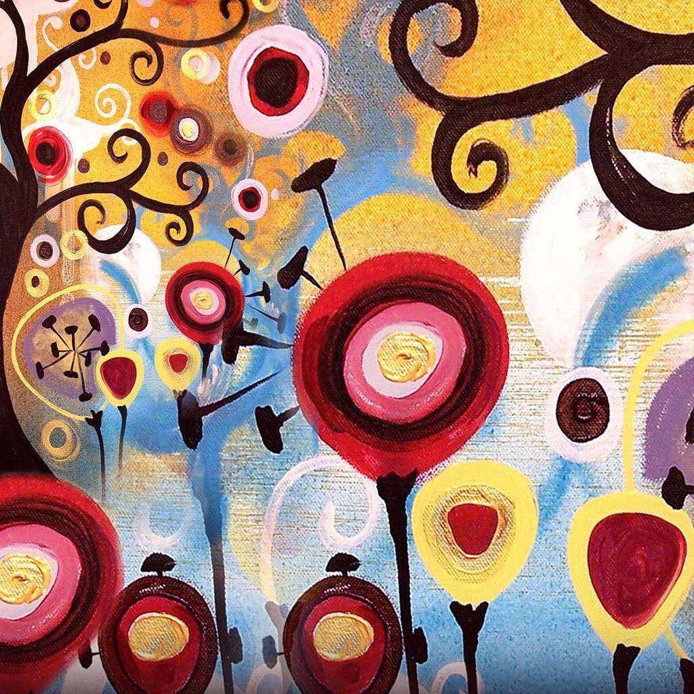
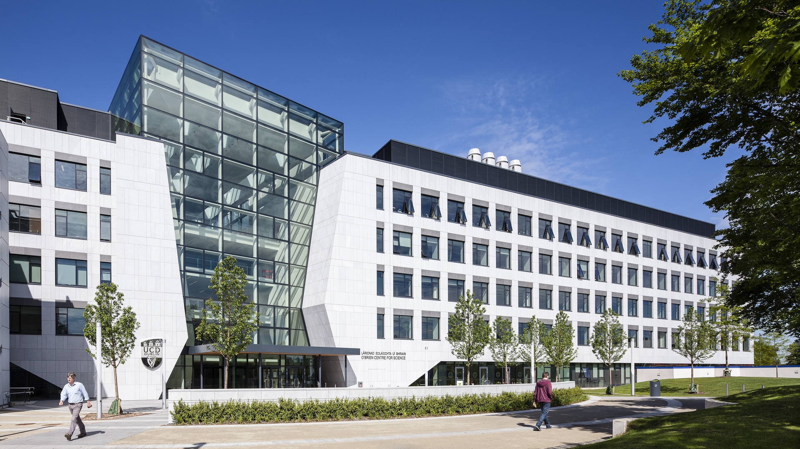
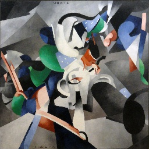
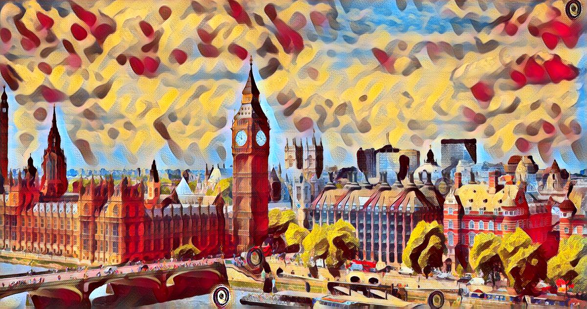
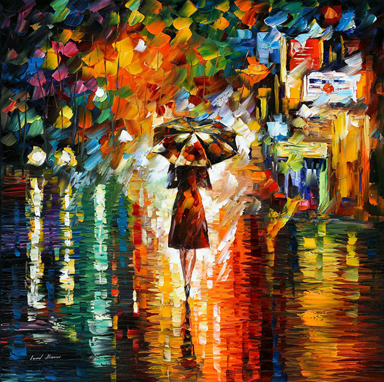

# <a href = 'https://pytorch.org/'></a> Neural-Artist, Feed-Forward Styling in Pytorch
A fully featured implementation of Neural Style that includes videos, webcam and web stylization.
<p align = 'center'>Candy x Obrien Centre, University College Dublin</p>
<p align = 'center'>


<a href = 'images/results/obrien_candy.jpg'></a>
</p>
<p align = 'center'>It took 2.5 hours to train the feedforward algorithm on a gtx 1080, and less than 300ms to test on a 1920x1080 photo of O'Brien Centre for Science</p>

Table of contents
=================

<!--ts-->
* [Home](#)
* [Image Styization](#image-stylization)
* [Training](#training)
  * [Setup](#setup)
  * [Running Training](#running-training)
  * [Customization](#customization)
* [Video Stylization](#video-stylization)
  * [How to](#how-to-video)
  * [Adding Audio](#audio)
* [Webcam Stylization](#webcam-stylization)
  * [How to](#how-to-webcam)
* [Export To Onnx](#export-to-onnx)
* [Acknowledgments](#acknowledgements)
* [Cool Stylized Examples](#example-image-transformations)
<!--te-->
Image Stylization
=================
Models are located in the models folder
```bash
python style.py --content {content_image} --model {path to model} --out {output image}
```
Example:
```bash
python style.py --content content.jpg --model model.pth --out output.jpg
```
Training
=================

## Setup
* Run ```Pip install requirments.txt``` in a new env
* Download data using ```setup_train.sh```

## Running Training
For simple Training run:

```bash
python style.py train --style images/style/wave_2.jpg --dataset data --checkpoint-dir models
```

## Customization
  * Model Customization, checkout [src/train.py](src/train.py)
    * You can also choose between VGG16 and VGG19
    * You can also choose specific style layers and content layers
  * Choose weights for Style, Content & TV Loss
  * Choose Loss Network input range (0,255) or (0,1)
  * Find out about Flags for hyperparameters [here](DOCS.md)

There are a multitude of variations you can do for training that will result in major differences.

For Example using the [256x256 Udnie](images/style/udnie_small.jpg) results in smaller feature transformers than the larger [512x512 Udnie](images/style/udnie.jpg)

<p align = 'center'>Small Feature Udnie</p>
<p align = 'center'>


<a href = 'images/results/obrien_udnie_small.jpg'></a>
</p>

<p align = 'center'>Large Feature Udnie</p>
<p align = 'center'>


<a href = 'images/results/obrien_udnie.jpg'></a>
</p>


Video Stylization
=================
<p align = 'center'>K-pop is in, right?</p>
<p align = 'center'>


<a href = 'images/results/blackpink_cubist.gif'></a>
</p>
<p align = 'center'>
It took 22 minutes on a GTX 1080 to style the full (1920x1080) video by <a href = 'https://www.youtube.com/watch?v=32si5cfrCNc'>Black Pink</a>. Full video <a href = 'https://drive.google.com/file/d/1HSOVhgkP1omsjxhPrXpJxRWzSaR24Tss/view?usp=sharing'>here</a>.
</p>

## How to Video:

You can produce a simple mp4 video using the following command:
```bash
python style.py video --model {path to model} --content {path to content video} --output-dir {output path} --show-frame {True/False, shows current Frame being processed}
```
Example:
```bash
python style.py video --model models/style_cubist.pth --content images/content/blackpink.mp4 --output-dir images/results
```

## Audio
Audio isn't processed with opencv, so you'll have to use [ffmpeg](https://ffmpeg.org/) if you want audio added to your video.
```
ffmpeg -i {input mp4} -i {input audio mp4 or mp3} -c copy output.mp4
```

Example:
```
ffmpeg -i images/results/blackpink.mp4 -i audio.mp3 -c copy output.mp4
```

Webcam Stylization
=================

<p align = 'center'>
<a href = 'images/style/udnie.jpg'></a>
<a href = 'images/style/wave_light.jpg'></a>
<a href = 'images/style/candy.jpg'></a>
<a href = 'images/style/cubist.jpg'></a>
</p>
<p align = 'center'><a href = 'images/style/udnie.jpg'>Udnie</a> <a href = 'images/style/wave_light.jpg'>Wave</a></p>
<p align = 'center'><a href = 'images/style/candy.jpg'>Candy</a> <a href = 'images/style/cubist.jpg'>Cubist</a></p>

### How to Webcam:
You can produce live webcam styling using the following:
```bash
python style.py cam --model {path to model} --width {Your chosen camera width} --height {Your chosen camera height}
```
Example
```bash
python style.py cam --model models/udnie.pth
```

Export to Onnx
=================
For wide platform compatibility I've added the option to export to Onnx. I have plans to try and use ONNX.js for native on-browser stylization.

```bash
python style.py export --model {model path} --output-dir {output path}
```
Example:
```bash
python style.py export --model models/udnie.pth
```

Acknowledgements
=================
* Original Algorithm by Leon A. Gatys: [A Neural Algorithm of Artistic Style](https://arxiv.org/abs/1508.06576)
* Feedforward method developed by Justin Johnson: [Perceptual Losses for Real-Time Style Transfer and Super-Resolution](http://cs.stanford.edu/people/jcjohns/eccv16/)
* Justin Johnson's [Original Repo](https://github.com/jcjohnson/fast-neural-style) that I used for hyperparameter optimization
* [Demystifying Neural Style Transfer](https://arxiv.org/pdf/1701.01036.pdf)
* Improved Fast Stylization using [Instance Normalization](https://arxiv.org/abs/1607.08022) by Dmitry Ulyanov
* [Pytorch example library](https://github.com/pytorch/examples/blob/master/fast_neural_style) I used for implementing the auto encoder and debugging(Normalizing input completely flew over my head 🙃)
* I got the cubist painting from [hzy46](https://github.com/hzy46/fast-neural-style-tensorflow), I don't know where it's from unfortunately.
* README styling influenced by [Lengstrom](https://github.com/lengstrom) and [Justin Johnson](https://github.com/jcjohnson/fast-neural-style)

Example Image Transformations
=================

<a href = "https://images.musement.com/cover/0002/49/big-ben-westminster-bridge-on-river-thames-in-london-jpg_header-148518.jpeg?w=1200&h=630&q=95&fit=crop">
<p align = 'center'> London</p>
</a>
<p align = 'center'>






</p>